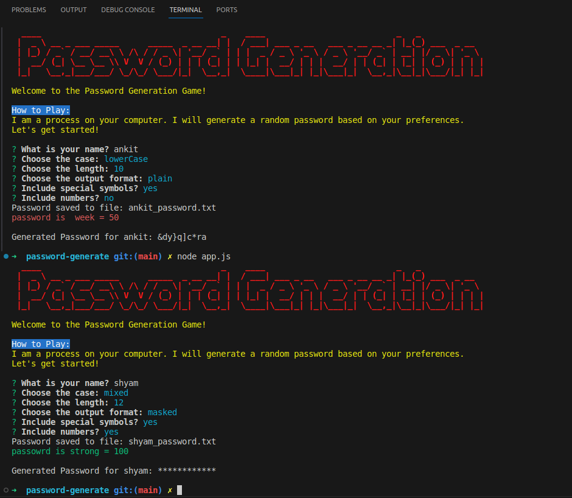

# CLI tool for password generation
- It is a password generation cli tools
- It give you the password in console 
- It has following features 
  - option to choose the character type
     - lower case, upper case or mixed
  - option to choose length 
     - it has 4 option (8,10,12,14) length
  - it has a option to include the special symbol
      - yes or no
  - it has a option to include the numbers
      - yes or no
  - it has a option to print password in console
      - masked or plain
